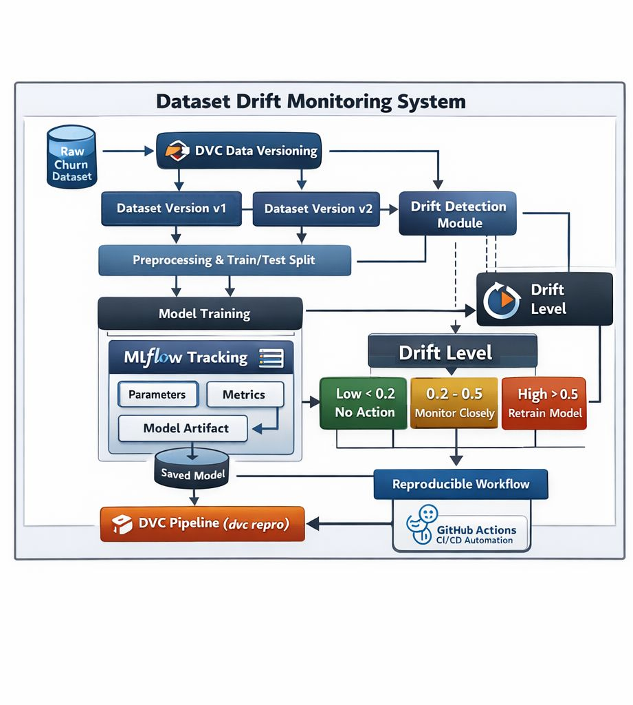
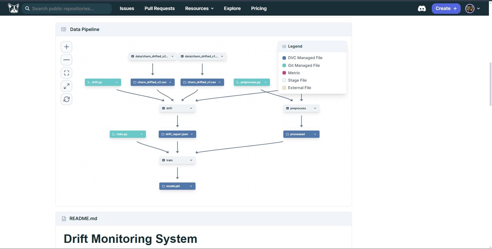
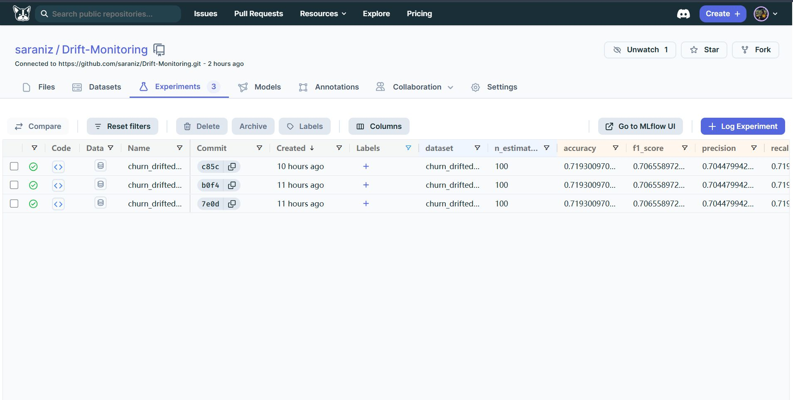
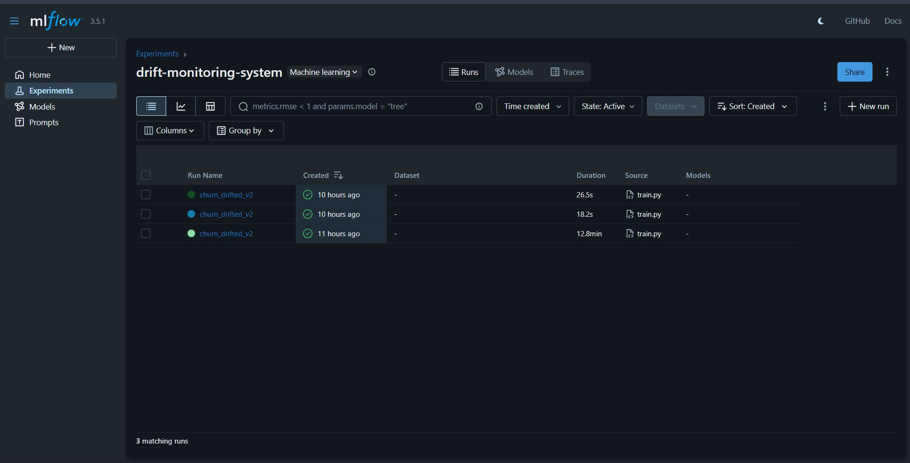
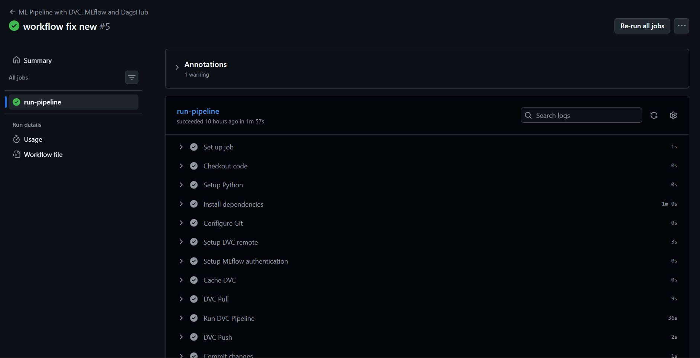

# Dataset Drift Monitoring System

A robust MLOps pipeline for Churn Prediction designed to simulate, detect, and handle dataset drift in production-like environments. This project focuses on understanding **Data Version Control (DVC)**, experiment tracking with **MLflow**, and automating CI/CD workflows using **GitHub Actions**, all hosted and visualized on **DagsHub**.

---

## 📌 Project Overview & Architecture

In real-world machine learning systems, data is not static. Customer behavior changes, market shifts occur, and systems update. This leads to **data drift**, which can silently degrade model performance as the model operates on patterns it was not trained on. 

This project simulates these real-world dynamics by introducing multiple dataset versions (representing different drift levels) and automating drift detection to drive model retraining decisions.

### System Architecture Flow



The pipeline is split into three main DVC stages:
1. **Preprocessing (`preprocess`)**: Reads dataset configurations from `config.yaml`, handles missing values, encodes categorical variables, and performs train/test splits.
2. **Drift Detection (`drift`)**: Compares drifted datasets against the baseline to measure distribution shifts using Statistical Tests (KS Test) and statistical property differences (Mean & Variance).
3. **Automated Model Training (`train`)**: Evaluates the drift report, automatically selects the dataset with the lowest drift, trains a `RandomForestClassifier`, and logs parameters, metrics, and model artifacts to MLflow on DagsHub.

---

## 🚀 Key Highlights

* **End-to-End Pipeline Reproducibility**: Built using **DVC (Data Version Control)** to manage dataset versions, pipeline tracking (`dvc.yaml`), and reproducibility.
* **Preprocessing Pipeline**: Structured workflow for cleaning, imputing, and transforming churn prediction data based on configurable schemas.
* **Drift Detection Module**: Compares dataset versions and measures distribution shifts across numerical and categorical features.
* **Automated Pipeline**: Ensures reproducible ML experiments from data ingestion and preparation to final model evaluation.
* **Experiment Tracking & Logging**: Track parameters, performance metrics, and model checkpoints using **MLflow** integrated with **DagsHub**.
* **CI/CD Automation**: Powered by **GitHub Actions** to automatically trigger pipeline checks, run `dvc repro`, and ensure consistent builds on every push and pull request.

---

## 📊 Pipeline Visualization & Experiments

### 1. DVC Data Pipeline (DAG)
DagsHub visualizes our versioned data pipeline, showing how raw datasets split into processed versions, pass through drift detection to generate a report, and feed into training to produce a saved model.



### 2. Experiment Tracking (MLflow & DagsHub)
Every training run is logged to MLflow, enabling comparison of metrics like Accuracy, Precision, Recall, and F1-score across different dataset versions.


*DagsHub Experiments interface showing model metrics (e.g., Accuracy ~0.7193) across runs.*


*MLflow Dashboard listing runs initiated by the automated training pipeline.*

### 3. CI/CD Workflow (GitHub Actions)
Every code check-in triggers a GitHub Action that pulls data from DVC, reproduces the pipeline steps, pushes updated model parameters to DagsHub, and commits the state changes.



---

## 🛠️ Drift Simulation & Interpretation

To test the system, we simulate two types of behavioral drifts:
1. **Gradual Drift (`churn_drifted_v1.csv`)**: Mimics mild behavior shifts, such as small increases in usage frequency and support calls, with minor churn adjustments.
2. **Strong Drift (`churn_drifted_v2.csv`)**: Mimics extreme changes, such as significantly increased support calls, payment delays, subscription downgrades to basic plans, and a higher overall churn rate.

### Drift Interpretation Rules
Drift scores are calculated as the average of Mean Difference, Variance Difference, and the Kolmogorov-Smirnov (KS) Statistic across all features:
* **Drift Score < 0.2**: `No Drift` (No action required)
* **0.2 ≤ Drift Score < 0.5**: `Mild Drift` (Monitor closely)
* **Drift Score ≥ 0.5**: `Strong Drift` (Retrain model)

---

## 📁 Project Structure

* `config.yaml`: Configuration file defining dataset paths, targets, and categorical/numerical features.
* `data/`: Contains raw, drifted, and processed datasets (tracked by DVC).
* `driftscripts/`: Scripts containing the rules for generating drifted datasets (`script1.py` and `script2.py`).
* `src/preprocess.py`: Cleans, encodes, and splits datasets according to config rules.
* `src/drift.py`: Run statistical comparisons to detect drift and output `reports/drift_report.json`.
* `src/train.py`: Reads the drift report, selects the best dataset version, trains a `RandomForestClassifier`, and tracks runs in MLflow.
* `dvc.yaml`: DVC pipeline specifying dependencies, commands, and outputs for each stage.

---

## 💻 How to Run Locally

### Prerequisites
Make sure you have DVC, MLflow, and the required dependencies installed:
```bash
pip install -r requirements.txt
pip install dvc dagshub mlflow
```

### Steps

1. **Simulate drifted datasets**:
   ```bash
   python driftscripts/script1.py
   python driftscripts/script2.py
   ```

2. **Reproduce the DVC pipeline**:
   Runs the preprocessing, drift detection, and automated training stages sequentially:
   ```bash
   dvc repro
   ```

3. **Push pipeline outputs/data versioning**:
   ```bash
   dvc push
   ```

---

## 💡 What I Learned

* **Deep Practical Understanding of DVC**: Mastered dataset versioning and pipeline control to ensure full experiment reproducibility.
* **Impact of Data Drift**: Observed firsthand how dataset changes directly impact model performance, proving why passive model deployment is insufficient.
* **End-to-End MLOps Systems**: Learned how to design ML systems that are maintainable, reproducible, and robust over time.
* **Integrated Workflows**: Connected data versioning, training, tracking, and monitoring into a single, cohesive CI/CD automated workflow.

---

## 🔗 Project Links

* **GitHub Repository**: [https://lnkd.in/gnpQ8HGP](https://lnkd.in/gnpQ8HGP)
* **DagsHub Repository**: [https://lnkd.in/gmWdGP_7](https://lnkd.in/gmWdGP_7)